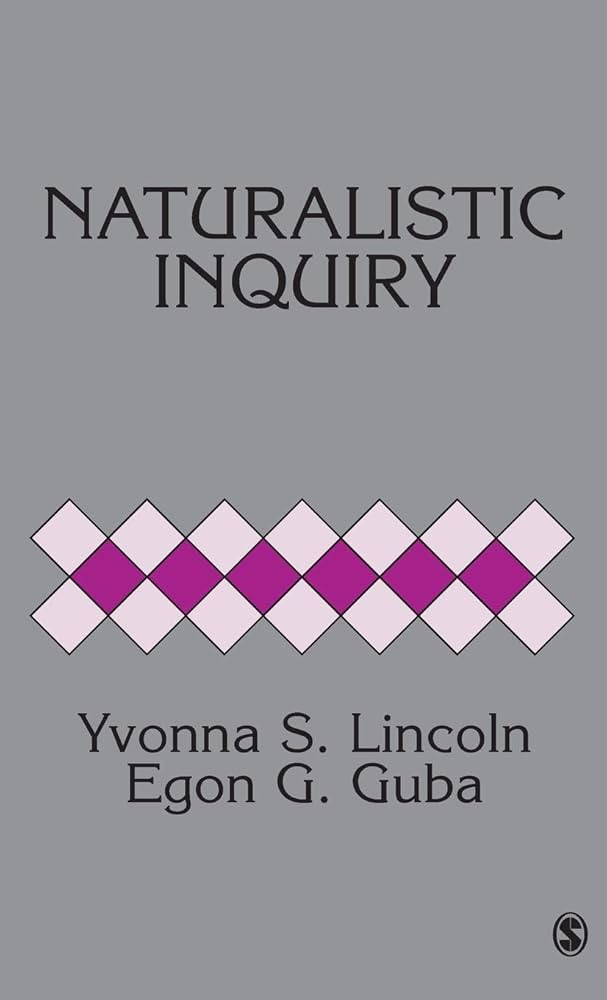
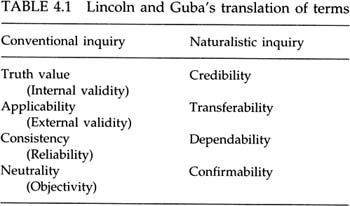
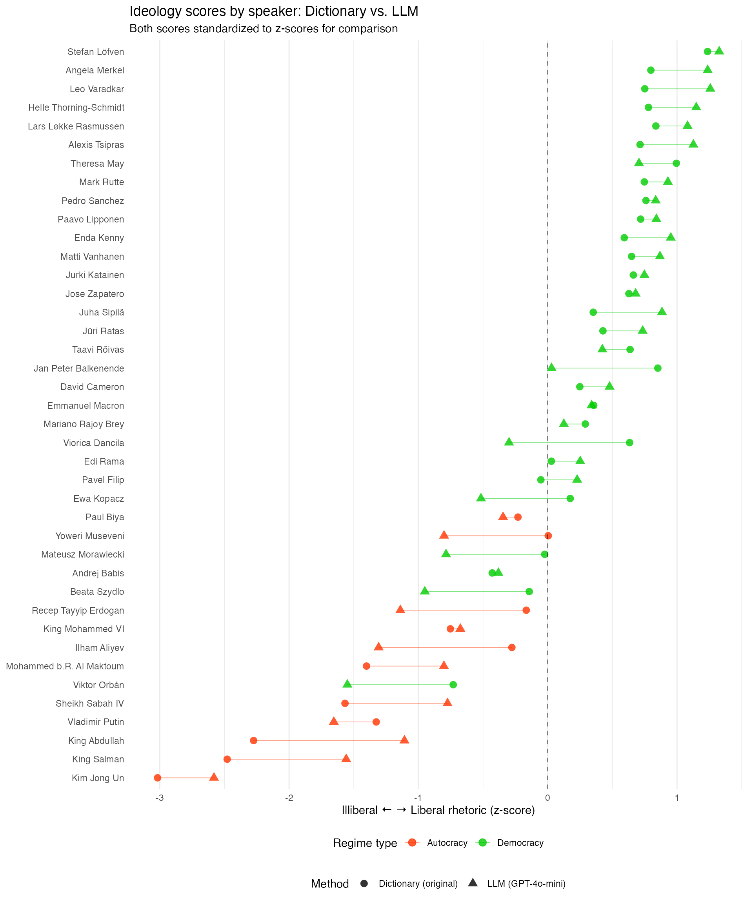

## About This Workshop

**Goals:**

- Understand basics of LLM-based text analysis
- Learn the core workflow of the quallmer tool (5 steps)
- Replicate a real research example
- Start using quallmer for your own projects
- Know how to validate and document your analysis

::: {.callout-tip}
## Materials
Detailed documentation of the tool: [quallmer.github.io/quallmer](https://quallmer.github.io/quallmer)

[Slides and tutorial available on QuantLab website: quantilab.github.io](https://quantilab.github.io/)
:::

## About Me

- Senior Lecturer in Political Science (Research Methods) at University of Melbourne
- Research: Democracy, authoritarianism, language of political leaders
- Co-founder of [QuantLab](https://quantilab.github.io/)
- Developer of [quallmer](https://quallmer.github.io/quallmer/index.html) (with Ken Benoit)

**Motivation:** Fight for democracy, making quantitative methods more accessible

Website: [seraphinem.github.io](https://seraphinem.github.io)

Workshops on instats on [AI-assisted text analysis and fine-tuning LLMs](https://instats.org/expert/seraphine-maerz-2?view=Seminars)

# Introduction

## LLMs as Qualitative Analysis Tools: Recent Contributions

**A growing body of research demonstrates LLMs' potential for qualitative text analysis:**

- **Benoit et al. (2026)**: [Using LLMs to analyze political texts through natural language understanding](https://onlinelibrary.wiley.com/doi/10.1111/ajps.70050). *American Journal of Political Science*. LLM-generated party position estimates correlate highly with expert ratings -- scalable alternative to human coders.

- **Halterman and Keith (2025)**: [Codebook LLMs: Evaluating LLMs as measurement tools for political science concepts](https://www.cambridge.org/core/journals/political-analysis/article/codebook-llms-evaluating-llms-as-measurement-tools-for-political-science-concepts/7B323A0E47F782F2698A0AE849EA00DE). *Political Analysis*. Systematic evaluation of LLMs for coding political science concepts with codebook guidance.

- **Hayes (2025)**: ["Conversing" with qualitative data](https://journals.sagepub.com/doi/full/10.1177/16094069251322346). *International Journal of Qualitative Methods*. LLMs enable researchers to explore qualitative data in a conversational way.

. . .

::: {.callout-note}
## Emerging Consensus
LLMs can complement (not replace!) traditional methods -- but require **validation**, **transparency**, and **methodological rigor**.
:::

## The Quant-Qual Dilemma

::: {.columns}
::: {.column width="50%"}
**Quantitative**

- Large N, generalizability
- Replicable & transparent
- Statistical rigor

*But:* Lacks depth, context, nuance
:::

::: {.column width="50%"}
**Qualitative**

- Rich detail & context
- Captures complexity
- Discovers unexpected patterns

*But:* Small N, labor-intensive, harder to generalize
:::
:::

. . .

::: {.callout-note}
## LLMs as a Bridge?
LLMs could combine **scale & replicability** with **contextual understanding** — but only if:

- Results are **validated** against human judgment
- The process is **transparent** and documented
- We maintain **audit trails** for rigor and replicability
:::

**quallmer** was developed with this vision — grounded in established insights from qualitative research methodology.

## Quality in Qualitative Research

::: {.columns}
::: {.column width="40%"}
{width=60%}
:::

::: {.column width="60%"}
{width=100%}

Lincoln & Guba's (1985) **trustworthiness criteria** and the importance of **audit trails** for transparency and rigor in qualitative research, Seale, C. (1999). Guiding ideals. In The Quality of Qualitative Research (pp. 32-50). SAGE Publications Ltd.
:::
:::

::: aside
Lincoln, Y. S., & Guba, E. G. (1985). *Naturalistic Inquiry*. Sage.
:::


# From Bag of Words to LLMs


## Pre-LLM Text Analysis

::: {.center}
```{mermaid}
%%| fig-width: 10
flowchart TB
    A[Corpus of documents] --> B[Document-feature matrix<br>'Bag of Words']
    B --> C[Supervised<br>known categories]
    B --> D[Unsupervised<br>unknown categories]
    C --> E[Dictionary &<br>Sentiment]
    C --> F[Wordscores &<br>Classifiers]
    D --> G[Topic Models]
    D --> H[Wordfish]

    B --> I[Word Embeddings<br>Word2Vec, GloVe]
    I -.-> J[Transformers<br>Attention mechanism]
    J -.-> K[Large Language<br>Models]

    style A fill:#b8d4e8,stroke:#333
    style B fill:#b8d4e8,stroke:#333
    style C fill:#b8d4e8,stroke:#333
    style D fill:#b8d4e8,stroke:#333
    style E fill:#b8d4e8,stroke:#333
    style F fill:#b8d4e8,stroke:#333
    style G fill:#b8d4e8,stroke:#333
    style H fill:#b8d4e8,stroke:#333
    style I fill:#b8d4e8,stroke:#333
    style J fill:#f0e68c,stroke:#333
    style K fill:#f0e68c,stroke:#333
```
:::

## Pre-LLM vs. LLM Approaches

::: {.columns}
::: {.column width="50%"}
**Traditional:**

- Dictionary methods
- Topic models
- Supervised learning
:::

::: {.column width="50%"}
**LLM-based:**

- Zero-shot classification
- Context-aware
- Can explain reasoning
:::
:::

**All (text) models are wrong -- but some are useful!**

## Why Use LLMs for Research?

| Challenge | Traditional | LLM-Based |
|-----------|-------------|-----------|
| Context | Limited | Strong |
| Training data | Often needed | Usually not |
| Cost | Can be high | Variable (depends on API) |
| Nuance | Struggles | Better |
| Reproducibility | Strong | Not 100% |

. . .

::: {.callout-important}
LLMs produce language -- not truth! **Validation is essential.**
:::

## Data Security & Ethical Considerations


**Key concerns when using LLMs:**

- **Privacy** -- Sensitive data uploaded to external servers (closed LLMs)
- **Reproducibility** -- Same prompts can give different responses
- **Bias & fairness** -- Models may reflect training data biases
- **Transparency** -- Training data often unknown (closed LLMs)
- **Resource consumption** -- Environmental impact of large models

. . .

**Reminder:** Use open-source LLMs for sensitive data; provide traceability; always validate!


# Current Landscape of LLM Tools for Text Analysis


## Existing Tools 

**Proprietary QDA software** (NVivo, MAXQDA, QDAMiner) have added AI-assisted coding, but:

- **GUI-only** -- No code-based workflow, analyses cannot be executed as code
- **Not reproducible** -- Results cannot be straightforwardly replicated
- **No comprehensive audit trails** -- Partial documentation at best
- **Opaque models** -- NVivo/MAXQDA don't disclose which model powers their AI
- **Not open-source**

. . .

**Custom LLM code** gives flexibility, but researchers must build infrastructure from scratch:

- Managing codebooks
- Tracking provenance
- Computing reliability metrics
- Documenting workflows

This can distract from substantive research questions.

## Working with LLMs in R

**General-purpose R packages for LLM access:**

- `ellmer` (Wickham et al., 2025)
- `ollamar` (Lin & Safi, 2025)
- `rollama` (Gruber & Weber, 2024)

Flexible LLM interfaces -- but **no qualitative methodology / text analysis support**.

. . .

**Text analysis packages:**

- `quanteda` (Benoit et al., 2018) -- quantitative text analysis, not AI-assisted qualitative coding

. . .

::: {.callout-note}
## The Gap
No existing tool addresses the specific methodological requirements of **trustworthy qualitative research** with LLMs.
:::


# Introducing quallmer


## What is quallmer?

{width=15% fig-align="center"}

An R package that enables researchers to apply **LLM-assisted qualitative coding** while maintaining the rigorous standards of **transparency and traceability** essential to qualitative research.

. . .

**Key features:**

- Works with texts, images, PDFs, audio, and tabular data
- Supports open-source and proprietary LLMs (OpenAI, Anthropic, Hugging Face, etc.)
- Built on the `ellmer` package (Wickham et al., 2025)
- Co-developed by Seraphine Maerz and Kenneth Benoit
- Available on CRAN: `install.packages("quallmer")`


## The quallmer Philosophy

::: {.columns}
::: {.column width="50%"}
**Simplicity & Accessibility**

- Minimal code required
- Clear, intuitive workflow
- Designed for newcomers to R
- Comprehensive tutorials and documentation
:::

::: {.column width="50%"}
**Rigor & Transparency**

- Built-in validation tools
- Automatic audit trails
- Full traceability of decisions
- Reproducible analyses
:::
:::

. . .

::: {.callout-tip}
## Getting Started
Step-by-step tutorials available at [quallmer.github.io/quallmer](https://quallmer.github.io/quallmer)
:::

## The 5-Step Workflow

| Step | Function(s) | Purpose |
|------|-------------|---------|
| 1. Define codebook | `qlm_codebook()` | Create reusable coding schemes with instructions and structured output schema |
| 2. Code data | `qlm_code()` | Apply codebook to texts, images, PDFs, audio, or tabular data using any supported LLM |
| 3. Replicate | `qlm_replicate()` | Re-run coding with different models or parameter settings, preserving provenance chains |
| 4. Compare & validate | `qlm_compare()`, `qlm_validate()` | Compute inter-rater reliability metrics; benchmark against human-coded gold standards |
| 5. Audit trail | `qlm_trail()` | Generate complete audit documentation and executable replication report |


# Example: Coding Political Speeches

## The Research Question

**Original Study:** Maerz & Schneider (2020), *Quality & Quantity*

- Corpus of 4,740 speeches by 40 heads of government in 27 countries
- Finding: Autocratic leaders use more illiberal language; some democratic leaders too (correlation with backsliding)

. . .

**Goal:** Replicate using LLMs instead of dictionary/topic model approach

- Can LLMs identify liberal-illiberal rhetoric?
- Do they correlate with human/dictionary codings?

## Step 1: Define the Codebook

```{r}
#| eval: false
#| echo: true
library(quallmer)

codebook_ideology <- qlm_codebook(
  name = "Liberal-illiberal rhetoric",
  instructions = "Analyze the rhetorical style of this political speech.
    ILLIBERAL rhetoric (negative scores): nationalism, paternalism, traditionalism.
    LIBERAL rhetoric (positive scores): individual rights, tolerance, civil liberties.
    Score 0 = neutral/mixed.",
  schema = type_object(
    score = type_integer("Score from -10 (illiberal) to +10 (liberal)"),
    explanation = type_string("Brief explanation of the score")
  )
)
```

The **schema** defines the structured output -- here, the LLM returns both a score *and* an explanation.


## Schema Options

The `schema` defines what the LLM returns:

| Type | Use for | Example |
|------|---------|---------|
| `type_integer()` | Fixed categories | `c("pos", "neg", "neutral")`|
| `type_string()` | Text/explanations | `"Brief explanation"` |
| `type_number()` | Number scores | `-10 to +10` |
| `type_boolean()` | Yes/no questions | `TRUE/FALSE` |
| `type_array()` | Lists of items | Persons, relationships, things, etc. |

::: {.callout-tip}
The schema is flexible -- you can ask for multiple fields and also nest objects for more complex outputs -- it can be nicely tailored to your research question. Think carefully about what you want to get back from the LLM, the schema will guide the response format and content!
:::


## Step 2: Code the Data

```{r}
#| eval: false
#| echo: true
coded_speeches <- qlm_code(
  speech_corpus,                    # character vector or quanteda corpus
  codebook = codebook_ideology,     # qlm_codebook object
  model = "openai/gpt-4o-mini",     # provider and model
  name = "ideology_coding_run1"     # user-assigned name
)
```

Returns a `qlm_coded` object with:

- Coding results (score, explanation)
- Full metadata (timestamps, model identifiers, codebook used)

## Step 3: Replicate

```{r}
#| eval: false
#| echo: true
# Replicate with a different model
coded_claude <- qlm_replicate(coded_speeches, model = "anthropic/claude-3-5-sonnet")

# Or with different parameter settings
coded_temp07 <- qlm_replicate(coded_speeches, temperature = 0.7)
```

**Provenance chains** link replicated results to their parent analyses.

## Step 4: Compare & Validate

```{r}
#| eval: false
#| echo: true
# Compare multiple LLM runs (inter-rater reliability)
comparison <- qlm_compare(coded_speeches, coded_claude, by = "score", level = "interval")

# Validate against human-coded gold standard
validation <- qlm_validate(coded_speeches, gold_standard, by = "score", level = "interval")
```

**Metrics available:**

- Krippendorff's alpha, Cohen's kappa, Fleiss' kappa
- Accuracy, precision, recall, F1 scores

For manual review and spot-checking, use the companion **quallmer.app** Shiny application -- see [tutorials](https://quallmer.github.io/quallmer) for details.

## Results: LLM vs. Dictionary Scores

::: {.columns}
::: {.column width="60%"}
{.lightbox width=800%}
:::

::: {.column width="40%"}
**LLM advantages:**

- Replicates dictionary results **fast and cost-effectively**
- Provides **explanations for each score**
- Enables **cross-model validation**
:::
:::

## Step 5: Audit Trail

```{r}
#| eval: false
#| echo: true
qlm_trail(coded_speeches, path = "replication_materials")

# Creates:
# - replication_materials.rds  (R object; complete trail data)
# - replication_materials.qmd  (executable Quarto replication report)
```

**Following Lincoln & Guba (1985), the audit trail includes:**

- Instrument development (codebook definition)
- Process notes & decisions (model parameters, timestamps)
- Parent-child relationships across analyses
- Complete replication code


# Best Practices

## Validation is Key!

**Three types:**

1. **Gold standard** -- Compare to human codings
2. **Intercoder reliability** -- Compare multiple LLMs
3. **Manual review** -- Spot-check outputs with [quallmer.app](https://quallmer.github.io/quallmer/articles/pkgdown/tutorials/validate.html)

::: {.callout-tip}
## quallmer.app
Interactive Shiny app for annotation & validation.
```r
install.packages("quallmer.app")
quallmer.app::qlm_app()
```
:::

## Open vs. Closed LLMs

::: {.columns}
::: {.column width="50%"}
**Closed** (OpenAI, Claude)

- Higher performance
- User-friendly
- Privacy concerns
:::

::: {.column width="50%"}
**Open** (Llama, Ollama)

- Full control
- Better for sensitive data
- More reproducible, fine-tuning options
:::
:::

**quallmer supports both!**

## Tips for Good Codebooks

1. **Be specific** -- Define categories clearly
2. **Provide examples** -- Show what each category looks like
3. **Use scales wisely** -- Ordinal vs. categorical
4. **Include explanation** -- See the LLM's reasoning
5. **Iterate** -- Test and refine


## Questions? Break?

{width=15% fig-align="center"}

**Coming up next:**

- Hands-on tutorial 
- Replicating a real research example 
- Starting your own project with quallmer 

**Were you able to prepare for the tutorial? (Installing R/RStudio, Ollama, openai API key?)**

- Takes 10-15 minutes to set up if you haven't already -- instructions available at QuantLab website: [quantilab.github.io](https://quantilab.github.io/sharezone/) / Sharezone


