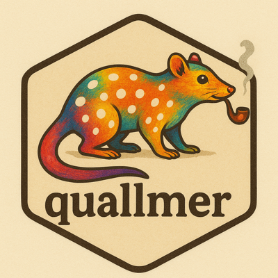

{width=20%}

<a href="https://cdn.jsdelivr.net/gh/quantilab/quantilab.github.io@main/sharezone/quallmer_tutorial.qmd" download="quallmer_tutorial.qmd">Download the tutorial file (.qmd)</a>

## About This Tutorial

This tutorial replicates the analysis from [Maerz & Schneider (2020)](https://link.springer.com/article/10.1007/s11135-019-00885-7), which examined liberal vs. illiberal rhetoric in political speeches. The original study used dictionary methods to analyze 4,740 speeches from 40 leaders across 27 countries.

**Here, we briefly replicate this analysis using LLMs** with the quallmer package. For the full version of the tutorial, see [here](https://quallmer.github.io/quallmer/articles/pkgdown/examples/example_illiberalism.html).

---

# Setup

```{r}
#| eval: false

# Install packages (run once)
install.packages("quallmer")
install.packages("tidyverse")

# Load packages
library(quallmer)
library(tidyverse)

# Load data from GitHub
url <- "https://github.com/quallmer/quallmer/raw/main/vignettes/pkgdown/examples/data/data_speeches_ms2020.rds"
data_speeches_ms2020 <- readRDS(url(url))

# Explore
dim(data_speeches_ms2020)
head(data_speeches_ms2020)
```

---

# Step 1: Define Codebook

The codebook tells the LLM what to look for and how to code it.

```{r}
#| eval: false

codebook_ideology <- qlm_codebook(
  name = "Liberal-illiberal rhetoric",

  instructions = paste(
    "Analyze the rhetorical style of this political speech.",
    "",
    "ILLIBERAL rhetoric (negative scores): nationalism, paternalism,",
    "emphasis on order/security, in-group/out-group distinctions.",
    "",
    "LIBERAL rhetoric (positive scores): individual rights, tolerance,",
    "pluralism, democratic values, rule of law.",
    "",
    "Consider the overall tone, not just individual words."
  ),

  schema = type_object(
    score = type_integer(
      description = "Score from -10 (very illiberal) to +10 (very liberal)"
    ),
    explanation = type_string(
      description = "Brief explanation of the assigned score"
    )
  ),

  role = "You are an expert political scientist analyzing political rhetoric."
)
```

---

# Step 2: Code Data

## Option A: Run the LLM

::: {.callout-warning}
## API Required
`qlm_code()` requires an API key and costs money. Skip to Option B to use pre-coded results.
:::

```{r}
#| eval: false

# Set your API key
Sys.setenv(OPENAI_API_KEY = "your-api-key-here")

# Prepare texts as named vector
texts <- data_speeches_ms2020$text
names(texts) <- data_speeches_ms2020$.id

# Code the speeches
coded_speeches <- qlm_code(
  texts,
  codebook = codebook_ideology,
  model = "openai/gpt-4o-mini"
)
```

## Option B: Load Pre-Coded Results

```{r}
#| eval: false

# Load pre-coded speeches
url_coded <- "https://github.com/quallmer/quallmer/raw/main/vignettes/pkgdown/examples/data/coded_ideology_gpt4o.rds"
coded_speeches <- readRDS(url(url_coded))

head(coded_speeches)
```

## Combine with Metadata

```{r}
#| eval: false

coded_with_meta <- data_speeches_ms2020 |>
  select(.id, speaker, country, regime, dictionary_score = score) |>
  left_join(
    coded_speeches |>
      as.data.frame() |>
      select(.id, llm_score = score, explanation),
    by = ".id"
  )

# View by regime type
coded_with_meta |>
  group_by(regime) |>
  summarise(n = n(), mean_llm = mean(llm_score, na.rm = TRUE))
```

---

# Step 3: Replicate (Optional)

::: {.callout-warning}
## API Required
`qlm_replicate()` requires an API key and costs money.
:::

Test robustness by replicating with different settings or models.

```{r}
#| eval: false

# Replicate with same settings (tests LLM consistency)
replicated <- qlm_replicate(coded_speeches)

# Or with a different model
replicated_gpt4o <- qlm_replicate(coded_speeches, model = "openai/gpt-4o")

# Compare
qlm_compare(coded_speeches, replicated, by = "score", level = "interval")
```

---

# Step 4: Compare & Validate

Validation is essential---LLMs produce language, not truth.

```{r}
#| eval: false

# Prepare dictonary scores for comparison
dictionary_coded <- coded_with_meta |>
  select(.id, score = dictionary_score) |>
  as_qlm_coded(name = "dictionary")

llm_coded <- coded_with_meta |>
  select(.id, score = llm_score) |>
  as_qlm_coded(name = "llm")

# Compare llm output with dictionary scores
comparison <- qlm_compare(
  dictionary_coded, llm_coded,
  by = "score",
  level = "interval",
  tolerance = 2 # Allow for some differences in scoring
)

print(comparison)
```

Agreement interpretation: <0.40 poor, 0.40-0.60 moderate, 0.60-0.80 substantial, >0.80 excellent.

Here, we see that while the LLM captures some of the same variance as the dictionary, it also captures additional nuance (hence rather low agreement). We might also need a more detailed codebook or more training examples ("few shot") to improve agreement.

If you have gold standard data (e.g., human annotations), use `qlm_validate()` to assess accuracy.

---

# Step 5: Document Audit Trail

Document your analysis for transparency and reproducibility.

```{r}
#| eval: false

qlm_trail(coded_speeches, path = "illiberal_analysis")
```

This creates an `.rds` file (reloadable R object) and a `.qmd` file (documentation).

---

# Visualize Results

```{r}
#| eval: false

library(ggplot2)

# Aggregate to speaker level with both scores
speaker_comparison <- coded_with_meta |>
  group_by(speaker, regime) |>
  summarise(
    llm_score = mean(llm_score, na.rm = TRUE),
    dictionary_score = mean(dictionary_score, na.rm = TRUE),
    .groups = "drop"
  ) |>
  mutate(
    llm_z = scale(llm_score)[,1],
    dictionary_z = scale(dictionary_score)[,1]
  )

# Scale plot comparing dictionary vs LLM
ggplot(speaker_comparison, aes(y = reorder(speaker, llm_z))) +
  geom_segment(aes(x = dictionary_z, xend = llm_z, yend = speaker),
               color = "gray70", linewidth = 0.5) +
  geom_point(aes(x = dictionary_z, color = regime), shape = 17, size = 3) +
  geom_point(aes(x = llm_z, color = regime), shape = 16, size = 3) +
  geom_vline(xintercept = 0, linetype = "dashed", color = "gray50") +
  scale_color_manual(values = c("Autocracy" = "#e41a1c", "Democracy" = "#4daf4a")) +
  labs(
    title = "Dictionary vs. LLM Scores",
    subtitle = "Triangle = Dictionary | Circle = LLM",
    x = "Illiberal <---> Liberal (z-score)",
    y = NULL
  ) +
  theme_minimal()
```

{width=100%}


Comparing the scales of dictionary vs. LLM scores shows that while the agreement is generally rather low, both do pick up the overall pattern of more illiberal language in autocracies as well as illiberal language by leaders in backsliding democracies. More refined codebooks, more training examples, or more powerful models may improve agreement. 

---

# Summary

| Step | Function | Purpose |
|------|----------|---------|
| 1 | `qlm_codebook()` | Define coding scheme |
| 2 | `qlm_code()` | Apply LLM coding |
| 3 | `qlm_replicate()` | Test robustness |
| 4 | `qlm_compare()` | Assess reliability |
| 5 | `qlm_trail()` | Create audit trail |

---

# Resources

- **Package & tutorials:** [quallmer.github.io/quallmer](https://quallmer.github.io/quallmer)
- **Original paper:** [Maerz & Schneider (2020), *Quality & Quantity*](https://link.springer.com/article/10.1007/s11135-019-00885-7)

---

<footer>© 2026 Seraphine F. Maerz. Made with Quarto and Claude assistance.</footer>
